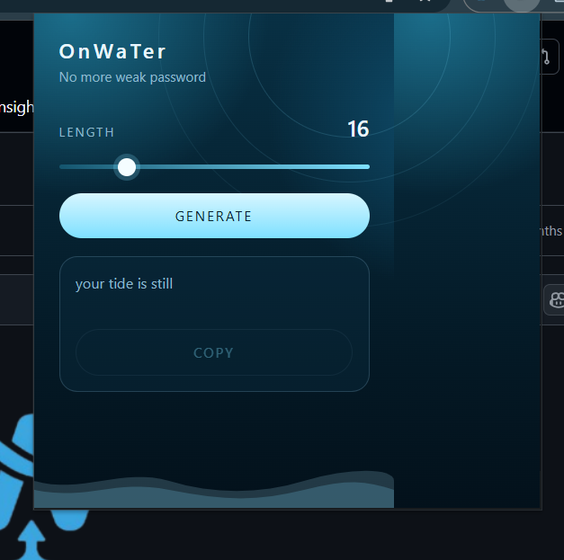

# OnWaTer

A minimal Chrome extension that generates strong passwords. Water theme, quiet UI.

## Features

- Choose a password length from 8 to 48
- Generate a mixed password of letters, numbers, and symbols
- Copy the result in one click

## Install

1. Open `chrome://extensions`
2. Turn on **Developer mode**
3. Click **Load unpacked**
4. Select this folder

Then pin **OnWaTer** from the Chrome toolbar and click the icon.

## Use

1. Drag **length** to the size you want
2. Click **Generate**
3. Click **Copy** to put the password on your clipboard

## Files

| File | Role |
| --- | --- |
| `manifest.json` | Extension config |
| `popup.html` | Popup layout |
| `index.css` | Water theme |
| `index.js` | Generate and copy |
| `OnWaTer.png` | Toolbar icon |
